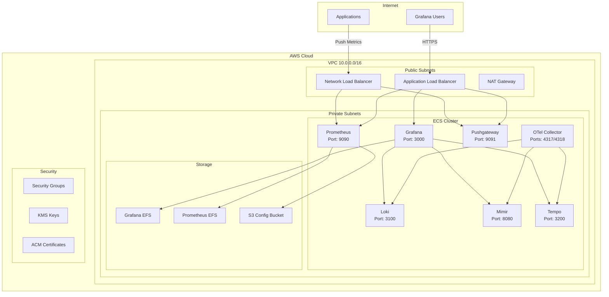
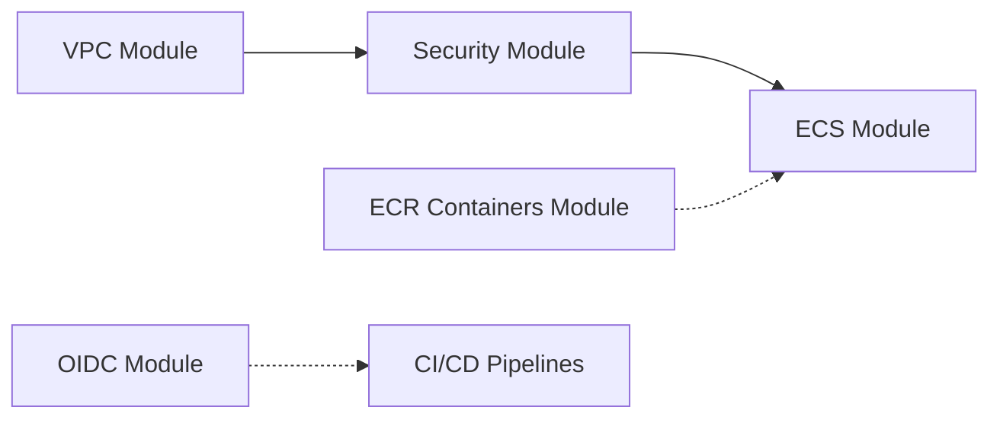
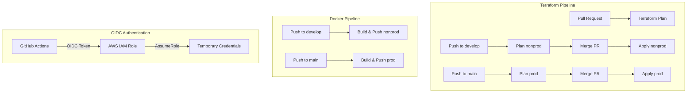

# Grafana Stack on AWS

A complete observability stack deployment on AWS using Terraform, featuring Prometheus, Grafana, Loki, Mimir, Tempo, and OpenTelemetry Collector.

## Architecture



## Project Structure

```
grafana-stack-aws/
├── .github/
│   └── workflows/
│       ├── terraform.yml         # Terraform plan/apply CI/CD
│       └── docker-build.yml      # Docker build/push CI/CD
├── environments/
│   ├── nonprod/
│   │   ├── README.md
│   │   ├── main.tf
│   │   ├── variables.tf
│   │   ├── terraform.tfvars
│   │   └── backend.tf
│   └── prod/
│       ├── README.md
│       ├── main.tf
│       ├── variables.tf
│       ├── terraform.tfvars
│       └── backend.tf
├── modules/
│   ├── oidc/
│   │   ├── main.tf               # GitHub OIDC provider + IAM role
│   │   ├── variables.tf
│   │   └── outputs.tf
│   ├── vpc/
│   │   ├── README.md
│   │   ├── main.tf
│   │   ├── variables.tf
│   │   ├── outputs.tf
│   │   └── flow-logs.tf
│   ├── security/
│   │   ├── README.md
│   │   ├── main.tf
│   │   ├── variables.tf
│   │   ├── outputs.tf
│   │   ├── kms.tf
│   │   └── acm.tf
│   ├── ecs/
│   │   ├── README.md
│   │   ├── main.tf
│   │   ├── ecr.tf
│   │   ├── efs.tf
│   │   ├── alb.tf
│   │   ├── iam.tf
│   │   ├── s3.tf
│   │   ├── service-discovery.tf
│   │   ├── cloudwatch.tf
│   │   ├── prometheus.tf
│   │   ├── grafana.tf
│   │   ├── pushgateway.tf
│   │   ├── loki.tf
│   │   ├── mimir.tf
│   │   ├── tempo.tf
│   │   ├── otel.tf
│   │   ├── variables.tf
│   │   └── outputs.tf
│   └── ecr-containers/
│       ├── README.md
│       ├── ecr.tf
│       ├── variables.tf
│       ├── outputs.tf
│       ├── loki/
│       │   ├── Dockerfile
│       │   └── loki-config.yaml
│       ├── grafana/
│       │   ├── Dockerfile
│       │   └── grafana.ini
│       ├── mimir/
│       │   ├── Dockerfile
│       │   └── mimir-config.yaml
│       ├── tempo/
│       │   ├── Dockerfile
│       │   └── tempo-config.yaml
│       └── otel/
│           ├── Dockerfile
│           └── otel-collector-config.yaml
└── README.md
```

## Documentation

| Component | Description | Link |
|-----------|-------------|------|
| **OIDC Module** | GitHub OIDC provider and IAM roles | [modules/oidc/README.md](modules/oidc/README.md) |
| **VPC Module** | Networking infrastructure (VPC, Subnets, Gateways) | [modules/vpc/README.md](modules/vpc/README.md) |
| **Security Module** | Security groups, KMS encryption, ACM certificates | [modules/security/README.md](modules/security/README.md) |
| **ECS Module** | ECS cluster, services, IAM roles, load balancers | [modules/ecs/README.md](modules/ecs/README.md) |
| **ECR Containers Module** | ECR repositories, Dockerfiles, configs | [modules/ecr-containers/README.md](modules/ecr-containers/README.md) |
| **Monitoring Module** | Lambda + shared SDK layer + EventBridge schedules that push metrics to the Pushgateway | [modules/monitoring](modules/monitoring) |
| **Nonprod Environment** | Non-production deployment configuration | [environments/nonprod/README.md](environments/nonprod/README.md) |
| **Prod Environment** | Production deployment configuration | [environments/prod/README.md](environments/prod/README.md) |

## Module Dependencies



1. **VPC Module** - Creates networking infrastructure (VPC, Subnets, NAT Gateway)
2. **Security Module** - Creates security groups and encryption keys (depends on VPC)
3. **ECS Module** - Creates ECS services and load balancers (depends on VPC, Security)
4. **ECR Containers Module** - Creates ECR repositories (independent)
5. **OIDC Module** - Creates GitHub OIDC provider and IAM roles (independent)
6. **Monitoring Module** - Lambda + shared SDK layer + EventBridge schedules; depends on VPC, Security and the ECS Pushgateway (writes to `:9091`)

## Services

| Service | Port | Description |
|---------|------|-------------|
| Grafana | 3000 | Visualization and dashboards |
| Prometheus | 9090 | Metrics collection and storage |
| Pushgateway | 9091 | Push metrics endpoint |

## Monitoring (custom scripts)

The `modules/monitoring` module adds the team's own monitoring scripts on top of the
observability stack. A single Lambda, triggered by multiple EventBridge schedules,
downloads a script from S3 and runs it; the script pushes metrics to the
**Pushgateway** (`:9091`), which Prometheus already scrapes, so the data shows up in
Grafana with no new pipeline.

- Scripts live in `monitoring-scripts/` and are uploaded to S3 by CI on merge.
- Each monitor is one entry in `monitoring_jobs` (see `environments/*/main.tf`).
- Shared Python SDK: `src/monitoring_sdk/` (packaged as a Lambda layer).
- See [modules/monitoring/README.md](modules/monitoring/README.md) for details, the
  alarm/heartbeat design, and the Grafana-side scrape requirement.

> **Grafana-side requirement:** the Prometheus config (in its S3 bucket) must scrape
> the Pushgateway **and** set `honor_labels: true`, or your per-monitor `job` labels
> are lost and metrics may not appear.
| Loki | 3100 | Log aggregation |
| Mimir | 8080 | Long-term metrics storage |
| Tempo | 3200 | Distributed tracing |
| OTel Collector | 4317/4318 | Telemetry collection and export |

## CI/CD Pipelines

### Overview



### GitHub Repository Variables

| Variable | Description |
|----------|-------------|
| `AWS_ACCOUNT_ID_NONPROD` | Nonprod AWS account ID |
| `AWS_ACCOUNT_ID_PROD` | Prod AWS account ID |

### Secrets

| Secret | Description |
|--------|-------------|
| `AWS_ROLE_ARN_NONPROD` | IAM role ARN for nonprod |
| `AWS_ROLE_ARN_PROD` | IAM role ARN for prod |

### Terraform Pipeline

| Event | Action | Environment |
|-------|--------|-------------|
| Pull Request to develop | Plan | nonprod |
| Push to develop | Apply | nonprod |
| Pull Request to main | Plan | prod |
| Push to main | Apply | prod |

### Docker Pipeline

| Event | Action | Environment |
|-------|--------|-------------|
| Push to develop (container changes) | Build & Push | nonprod |
| Push to main (container changes) | Build & Push | prod |

### Trigger Paths

Docker builds only trigger when files in these paths change:
- `modules/ecr-containers/loki/**`
- `modules/ecr-containers/grafana/**`
- `modules/ecr-containers/mimir/**`
- `modules/ecr-containers/tempo/**`
- `modules/ecr-containers/otel/**`

## Quick Start

### Prerequisites

- AWS CLI configured
- Terraform >= 1.0
- Docker (for building container images)
- GitHub repository with OIDC configured

### Initial Setup

```bash
# Clone the repository
git clone <repo_name>
cd grafana-stack-aws

# Deploy OIDC module (one-time setup)
cd modules/oidc
terraform init
terraform apply -var="github_org=<your-org>" -var="github_repo=<your-repo>"

# Deploy nonprod environment
cd ../../environments/nonprod
terraform init
terraform plan
terraform apply

# Deploy prod environment
cd ../prod
terraform init
terraform plan
terraform apply
```

### GitHub Actions Setup

1. Go to your GitHub repository Settings > Secrets and variables > Actions
2. Add repository variables:
   - `AWS_ACCOUNT_ID_NONPROD`: Your nonprod AWS account ID
   - `AWS_ACCOUNT_ID_PROD`: Your prod AWS account ID
3. Ensure the OIDC IAM roles are created in both AWS accounts

### Building Container Images

```bash
# Build all containers locally
cd modules/ecr-containers

# Build Loki
cd loki && docker build -t loki-repo-nonprod:latest . && cd ..

# Build Grafana
cd grafana && docker build -t grafana-repo-nonprod:latest . && cd ..

# Build Mimir
cd mimir && docker build -t mimir-repo-nonprod:latest . && cd ..

# Build Tempo
cd tempo && docker build -t tempo-repo-nonprod:latest . && cd ..

# Build OTel Collector
cd otel && docker build -t otel-repo-nonprod:latest . && cd ..
```

## Backend Configuration

Both environments use S3 backend with versioning:

| Environment | S3 Bucket | Key |
|-------------|-----------|-----|
| nonprod | grafana-stack-terraform-state | nonprod/terraform.tfstate |
| prod | grafana-stack-terraform-state | prod/terraform.tfstate |

## Security Features

- **VPC Flow Logs**: Network traffic logging
- **Security Groups**: Layered access control
- **KMS Encryption**: Data at rest encryption
- **SSL/TLS**: ACM certificates for HTTPS
- **EFS Encryption**: Encrypted file systems
- **S3 Encryption**: Encrypted object storage
- **OIDC Authentication**: Secure GitHub Actions authentication

## Contributing

1. Create a feature branch from develop
2. Make your changes
3. Update documentation if needed
4. Submit a pull request to develop
5. After review, merge to develop (deploys to nonprod)
6. Create PR from develop to main for production deployment

## License

This project is licensed under the MIT License - see the LICENSE file for details.
