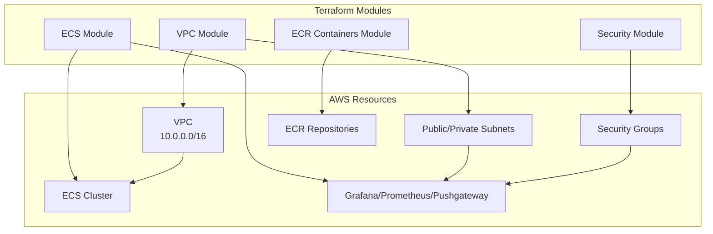
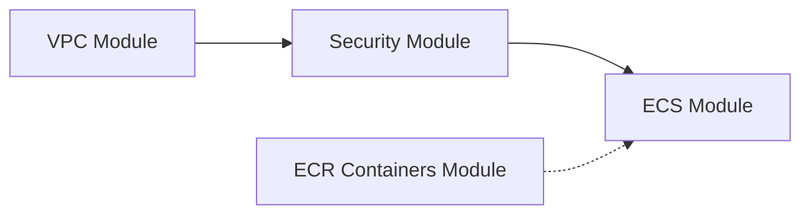

# Prod Environment

## Overview

This environment deploys the Grafana Stack for production use with high availability and security hardening.

## Architecture



## Files

| File | Description |
|------|-------------|
| `main.tf` | Provider config and module calls |
| `variables.tf` | Variable declarations |
| `terraform.tfvars` | Environment-specific values |
| `backend.tf` | S3 backend configuration |

## Backend Configuration

```hcl
terraform {
  backend "s3" {
    bucket         = "grafana-stack-terraform-state"
    key            = "prod/terraform.tfstate"
    region         = "us-east-1"
    encrypt        = true
    versioning     = true
  }
}
```

## Environment Values

| Variable | Value |
|----------|-------|
| `project_name` | grafana-stack |
| `env_subfix` | prod |
| `region` | us-east-1 |
| `tags_project.Environment` | prod |

## Deployment

```bash
cd environments/prod

# Initialize Terraform
terraform init

# Plan changes
terraform plan

# Apply changes
terraform apply
```

## Module Dependencies



1. **VPC Module** - Creates networking infrastructure
2. **Security Module** - Creates security groups (depends on VPC)
3. **ECS Module** - Creates ECS services (depends on VPC, Security)
4. **ECR Containers Module** - Creates ECR repos (independent)

## Production Considerations

- Use specific Docker image tags instead of `:latest`
- Configure appropriate `desired_count` for ECS services
- Enable deletion protection on EFS and S3
- Configure CloudWatch alarms for monitoring
- Set up backup policies for EFS
