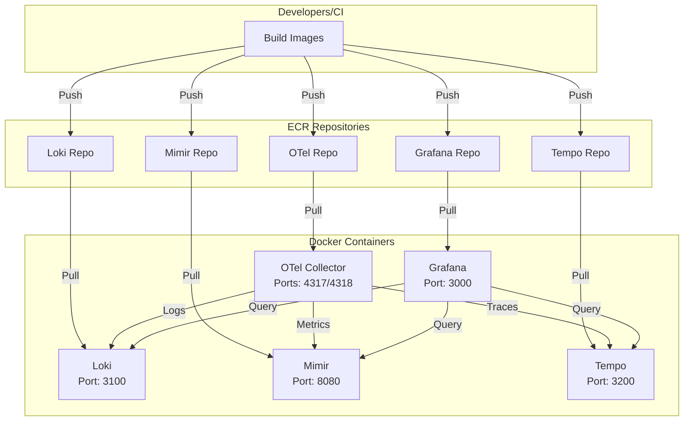
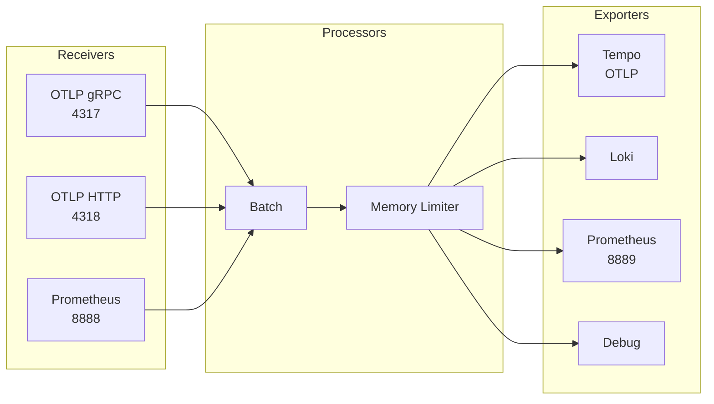

# ECR Containers Module

## Overview

This module manages ECR repositories and Docker configurations for the observability stack containers (Loki, Grafana, Mimir, Tempo, and OTel Collector). Each service has its own Dockerfile and configuration files.

## Architecture



## Services

| Service | Base Image | Port | Config File |
|---------|------------|------|-------------|
| Loki | grafana/loki:latest | 3100 | loki-config.yaml |
| Grafana | grafana/grafana:latest | 3000 | grafana.ini |
| Mimir | grafana/mimir:latest | 8080 | mimir-config.yaml |
| Tempo | grafana/tempo:latest | 3200 | tempo-config.yaml |
| OTel Collector | otel/opentelemetry-collector-contrib:latest | 4317/4318 | otel-collector-config.yaml |

## Docker Configurations

### Loki
- **Storage**: Local filesystem
- **Schema**: TSDB (v13)
- **Features**: Compaction, retention, analytics disabled

### Grafana
- **Storage**: SQLite3
- **Plugins**: Image renderer support
- **Security**: Admin user configured

### Mimir
- **Mode**: Single-binary
- **Storage**: Local filesystem with WAL
- **Features**: Metrics generation, service graphs

### Tempo
- **Storage**: Local filesystem with WAL
- **Receivers**: OTLP (gRPC/HTTP)
- **Features**: Metrics generator, exemplars

### OTel Collector
- **Receivers**: OTLP (gRPC/HTTP), Prometheus
- **Processors**: Batch, memory limiter
- **Exporters**: Tempo, Loki, Prometheus, Debug

## Resources Created

| Resource | Description |
|----------|-------------|
| `aws_ecr_repository.loki_repo` | ECR repository for Loki |
| `aws_ecr_repository.grafana_repo` | ECR repository for Grafana |
| `aws_ecr_repository.mimir_repo` | ECR repository for Mimir |
| `aws_ecr_repository.tempo_repo` | ECR repository for Tempo |
| `aws_ecr_repository.otel_repo` | ECR repository for OTel Collector |
| `aws_ecr_lifecycle_policy.*` | Lifecycle policies (keep last 10 images) |

## Variables

| Variable | Type | Default | Description |
|----------|------|---------|-------------|
| `project_name` | `string` | - | The name of the project |
| `env_subfix` | `string` | - | Environment suffix |
| `region` | `string` | - | AWS region |
| `tags_project` | `map(string)` | - | Tags to apply to all resources |

## Outputs

| Output | Description |
|--------|-------------|
| `loki_repo_url` | ECR repository URL for Loki |
| `grafana_repo_url` | ECR repository URL for Grafana |
| `mimir_repo_url` | ECR repository URL for Mimir |
| `tempo_repo_url` | ECR repository URL for Tempo |
| `otel_repo_url` | ECR repository URL for OTel Collector |

## Usage

```hcl
module "ecr_containers" {
  source = "../../modules/ecr-containers"

  project_name = "grafana-stack"
  env_subfix   = "nonprod"
  region       = "us-east-1"
  tags_project = {
    Project     = "grafana-stack"
    Environment = "nonprod"
    ManagedBy   = "terraform"
  }
}
```

## Building and Pushing Images

```bash
# Build Loki image
cd modules/ecr-containers/loki
docker build -t loki-repo-nonprod:latest .
docker tag loki-repo-nonprod:latest <account-id>.dkr.ecr.us-east-1.amazonaws.com/loki-repo-nonprod:latest
docker push <account-id>.dkr.ecr.us-east-1.amazonaws.com/loki-repo-nonprod:latest

# Repeat for other services
```

## OTel Collector Pipeline


