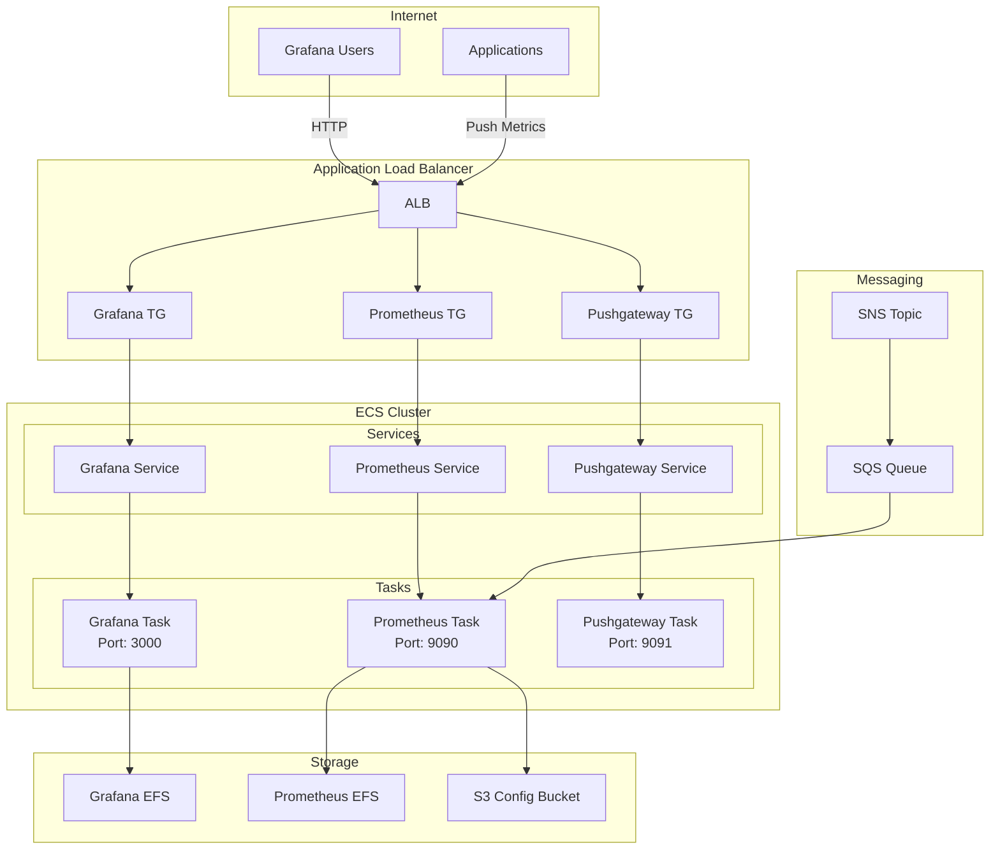

# ECS Module

## Overview

This module deploys the core monitoring stack (Prometheus, Grafana, and Pushgateway) on AWS ECS Fargate. It includes ECR repositories, ECS task definitions, services, EFS volumes for persistent storage, and IAM roles.

## Architecture



## Services

### Grafana
- **Port**: 3000
- **CPU**: 256
- **Memory**: 512 MB
- **Storage**: EFS for persistent dashboards
- **Features**: Service Connect discovery, ALB exposure

### Prometheus
- **Port**: 9090
- **CPU**: 512
- **Memory**: 1024 MB
- **Storage**: EFS for time series data
- **Features**: S3 config, SQS config updates, Service Connect

### Pushgateway
- **Port**: 9091
- **CPU**: 256
- **Memory**: 512 MB
- **Features**: Service Connect, NLB exposure

## Resources Created

| Resource | Description |
|----------|-------------|
| `aws_ecs_cluster.ecs_prometheus-grafana-cluster` | ECS cluster |
| `aws_ecr_repository.*` | ECR repositories (3) |
| `aws_ecs_task_definition.*` | ECS task definitions (3) |
| `aws_ecs_service.*` | ECS services (3) |
| `aws_efs_file_system.*` | EFS file systems (2) |
| `aws_efs_mount_target.*` | EFS mount targets |
| `aws_efs_access_point.*` | EFS access points |
| `aws_s3_bucket.prometheus_config` | S3 bucket for Prometheus config |
| `aws_lb.grafana_alb` | Application Load Balancer |
| `aws_lb_target_group.*` | ALB target groups |
| `aws_lb_listener.*` | ALB listeners |
| `aws_service_discovery_private_dns_namespace.monitoring_dns` | Service Connect namespace |
| `aws_iam_role.*` | IAM roles (ECS task, execution, eventbridge) |
| `aws_iam_policy.*` | IAM policies |
| `aws_cloudwatch_log_group.*` | CloudWatch log groups |
| `aws_sns_topic.config_updates` | SNS topic for config updates |
| `aws_sqs_queue.prometheus_config_updates` | SQS queue for config updates |

## Variables

| Variable | Type | Description |
|----------|------|-------------|
| `project_name` | `string` | The name of the project |
| `env_subfix` | `string` | Environment suffix |
| `region` | `string` | AWS region |
| `aws_account_id` | `string` | AWS Account ID |
| `vpc_id` | `string` | The ID of the VPC |
| `private_subnet_ids` | `list(string)` | Private subnet IDs |
| `public_subnets` | `list(string)` | Public subnet IDs |
| `private_subnets` | `list(string)` | Private subnet IDs |
| `ecs_sg_id` | `string` | Security Group ID for ECS |
| `prometheus_efs_sg_id` | `string` | Security Group ID for Prometheus EFS |
| `alb_sg_id` | `string` | Security Group ID for ALB |
| `tags_project` | `map(string)` | Tags to apply to all resources |
| `prometheus_nlb_dns_name` | `string` | NLB DNS name for Prometheus |
| `prometheus_pushgateway_tg` | `string` | Pushgateway Target Group ARN |
| `prometheus_main_tg` | `string` | Prometheus Target Group ARN |
| `pushgateway_private_dns_name` | `string` | Pushgateway DNS name |
| `prometheus_private_dns_name` | `string` | Prometheus DNS name |

## Outputs

| Output | Description |
|--------|-------------|
| `ecs_task_execution_role_arn` | ARN of the ECS task execution role |
| `efs_file_system_id` | ID of the Prometheus EFS |
| `efs_file_system_arn` | ARN of the Prometheus EFS |
| `grafana_alb` | DNS name of the Grafana ALB |
| `pushgateway_private_dns_name` | Pushgateway private DNS name |
| `prometheus_config_bucket` | S3 bucket name for Prometheus config |
| `cluster_name` | Name of the ECS cluster |
| `prometheus_service_name` | Name of the Prometheus ECS service |
| `grafana_service_name` | Name of the Grafana ECS service |
| `pushgateway_service_name` | Name of the Pushgateway ECS service |
| `cluster_arn` | ARN of the ECS cluster |
| `prometheus_service_arn` | ARN of the Prometheus ECS service |
| `grafana_service_arn` | ARN of the Grafana ECS service |
| `pushgateway_service_arn` | ARN of the Pushgateway ECS service |

## Usage

```hcl
module "ecs" {
  source = "../../modules/ecs"

  project_name            = "grafana-stack"
  env_subfix              = "nonprod"
  region                  = "us-east-1"
  aws_account_id          = "123456789012"
  vpc_id                  = module.vpc.vpc_id
  private_subnet_ids      = module.vpc.private_subnet_ids
  public_subnets          = module.vpc.public_subnet_ids
  private_subnets         = module.vpc.private_subnet_ids
  ecs_sg_id               = module.security.ecs_security_group_id
  prometheus_efs_sg_id    = module.security.efs_prometheus_security_group_id
  alb_sg_id               = module.security.alb_security_group_id
  tags_project            = var.tags_project
  prometheus_nlb_dns_name = "nlb.example.com"
  prometheus_pushgateway_tg = "arn:aws:elasticloadbalancing:..."
  prometheus_main_tg      = "arn:aws:elasticloadbalancing:..."
  pushgateway_private_dns_name = "prometheus-pushgateway.monitoring.dns"
  prometheus_private_dns_name  = "prometheus.monitoring.dns"
}
```

## IAM Roles

### ECS Task Execution Role
- ECR image pull permissions
- CloudWatch Logs permissions
- Secrets Manager access
- SSM Parameter Store access

### ECS Task Role
- S3 access for Prometheus config
- EFS access for persistent storage
- S3/SQS access for config updates
- ECS Exec (SSM) permissions

### EventBridge ECS Task Role
- ECS RunTask, StopTask, DescribeTasks
- IAM PassRole for task roles
