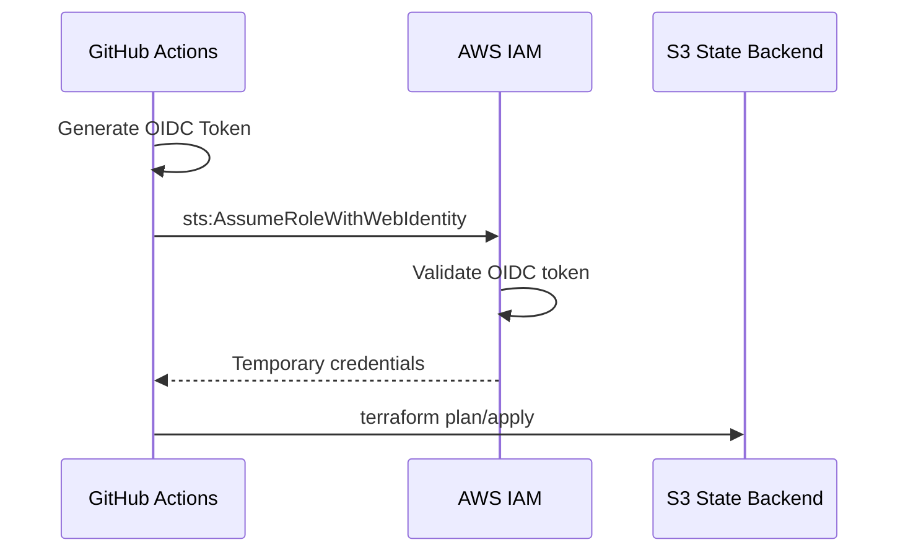
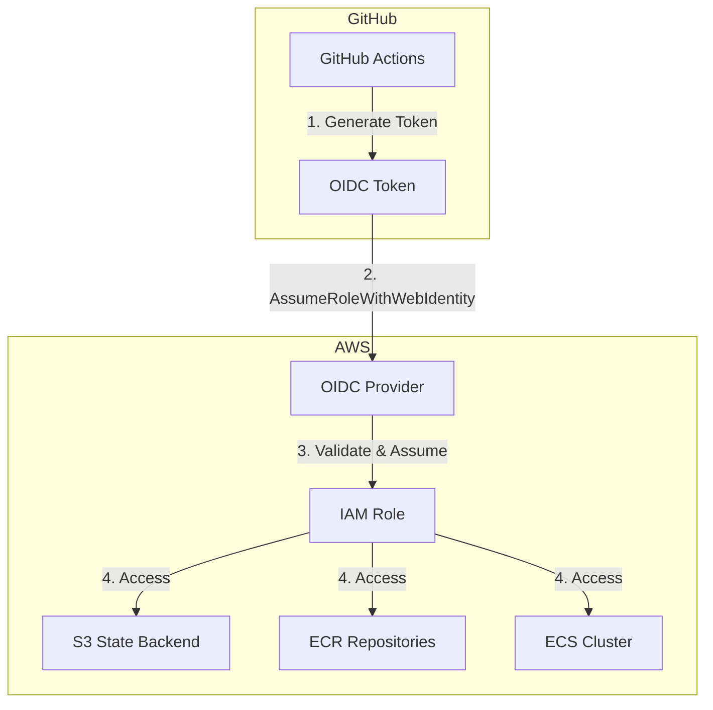

# OIDC Module

## Overview

This module creates the AWS IAM resources needed for GitHub Actions to authenticate using OIDC (OpenID Connect). This eliminates the need for long-lived AWS credentials stored in GitHub Secrets.

## Architecture





## Resources Created

| Resource | Description |
|----------|-------------|
| `aws_iam_openid_connect_provider.github` | OIDC provider for GitHub Actions |
| `aws_iam_role.github_actions` | IAM role for GitHub Actions |
| `aws_iam_role_policy.github_actions_terraform` | IAM policy for Terraform operations |

## IAM Permissions

The GitHub Actions role has permissions for:

- **S3**: State file management
- **ECR**: Container image management
- **ECS**: Container service management
- **EC2**: VPC, subnet, security group management
- **EFS**: File system management
- **ELB**: Load balancer management
- **IAM**: Role and policy management
- **CloudWatch**: Log group management
- **SSM**: Parameter store access
- **KMS**: Key management
- **ACM**: Certificate management

## Variables

| Variable | Type | Description |
|----------|------|-------------|
| `project_name` | `string` | The name of the project |
| `env_subfix` | `string` | Environment suffix |
| `github_org` | `string` | GitHub organization or username |
| `github_repo` | `string` | GitHub repository name |
| `tags_project` | `map(string)` | Tags to apply to all resources |

## Outputs

| Output | Description |
|--------|-------------|
| `oidc_provider_arn` | ARN of the OIDC provider |
| `github_actions_role_arn` | ARN of the IAM role for GitHub Actions |
| `github_actions_role_name` | Name of the IAM role for GitHub Actions |

## Usage

```hcl
module "oidc" {
  source = "../../modules/oidc"

  project_name = "grafana-stack"
  env_subfix   = "nonprod"
  github_org   = "your-github-org"
  github_repo  = "your-repo-name"
  tags_project = {
    Project     = "grafana-stack"
    Environment = "nonprod"
    ManagedBy   = "terraform"
  }
}
```

## Setup Instructions

### 1. Deploy OIDC Module

```bash
cd modules/oidc
terraform init
terraform apply \
  -var="github_org=your-org" \
  -var="github_repo=your-repo"
```

### 2. Configure GitHub Repository

1. Go to your GitHub repository Settings > Secrets and variables > Actions
2. Add repository variables:
   - `AWS_ACCOUNT_ID_NONPROD`: Your nonprod AWS account ID
   - `AWS_ACCOUNT_ID_PROD`: Your prod AWS account ID

### 3. Update IAM Role ARNs

Update the role ARNs in `.github/workflows/terraform.yml` and `.github/workflows/docker-build.yml`:

```yaml
echo "role_arn=arn:aws:iam::${{ vars.AWS_ACCOUNT_ID_NONPROD }}:role/grafana-stack-github-actions-nonprod" >> $GITHUB_OUTPUT
```

## Security Considerations

- OIDC tokens are short-lived (1 hour by default)
- No long-lived credentials stored in GitHub
- IAM role is scoped to the specific repository
- Permissions follow least-privilege principle
