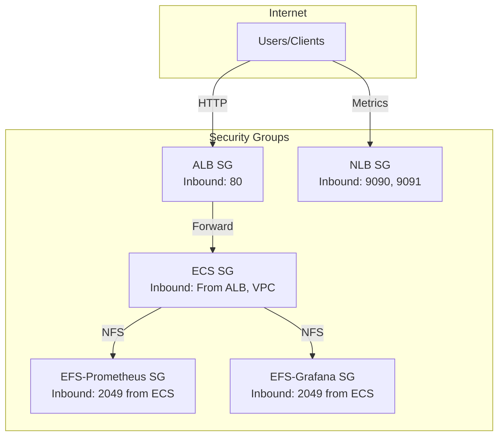

# Security Module

## Overview

This module manages security groups for the Grafana Stack. It provides a layered security approach with dedicated security groups for each component.

## Architecture



## Security Groups

### ALB Security Group
| Direction | Port | Protocol | Source/Destination |
|-----------|------|----------|-------------------|
| Inbound | 80 | TCP | 0.0.0.0/0 |
| Outbound | All | All | 0.0.0.0/0 |

### ECS Security Group
| Direction | Port | Protocol | Source/Destination |
|-----------|------|----------|-------------------|
| Inbound | All | All | ALB Security Group |
| Inbound | All | All | VPC CIDR (10.0.0.0/16) |
| Outbound | All | All | 0.0.0.0/0 |

### EFS-Prometheus Security Group
| Direction | Port | Protocol | Source/Destination |
|-----------|------|----------|-------------------|
| Inbound | 2049 | TCP | ECS Security Group |
| Outbound | All | All | 0.0.0.0/0 |

### EFS-Grafana Security Group
| Direction | Port | Protocol | Source/Destination |
|-----------|------|----------|-------------------|
| Inbound | 2049 | TCP | ECS Security Group |
| Outbound | All | All | 0.0.0.0/0 |

### NLB Security Group
| Direction | Port | Protocol | Source/Destination |
|-----------|------|----------|-------------------|
| Inbound | 9090 | TCP | 0.0.0.0/0 |
| Inbound | 9091 | TCP | 0.0.0.0/0 |
| Outbound | All | All | 0.0.0.0/0 |

## Resources Created

| Resource | Description |
|----------|-------------|
| `aws_security_group.alb` | Security group for ALB |
| `aws_security_group.ecs` | Security group for ECS tasks |
| `aws_security_group.efs_prometheus` | Security group for Prometheus EFS |
| `aws_security_group.efs_grafana` | Security group for Grafana EFS |
| `aws_security_group.nlb` | Security group for NLB |

## Variables

| Variable | Type | Default | Description |
|----------|------|---------|-------------|
| `project_name` | `string` | - | The name of the project |
| `env_subfix` | `string` | - | Environment suffix |
| `region` | `string` | - | AWS region |
| `vpc_id` | `string` | - | The ID of the VPC |
| `vpc_cidr` | `string` | - | The CIDR block of the VPC |
| `tags_project` | `map(string)` | - | Tags to apply to all resources |

## Outputs

| Output | Description |
|--------|-------------|
| `alb_security_group_id` | Security group ID for ALB |
| `ecs_security_group_id` | Security group ID for ECS |
| `efs_prometheus_security_group_id` | Security group ID for Prometheus EFS |
| `efs_grafana_security_group_id` | Security group ID for Grafana EFS |
| `nlb_security_group_id` | Security group ID for NLB |

## Usage

```hcl
module "security" {
  source = "../../modules/security"

  project_name = "grafana-stack"
  env_subfix   = "nonprod"
  region       = "us-east-1"
  vpc_id       = module.vpc.vpc_id
  vpc_cidr     = module.vpc.vpc_cidr
  tags_project = {
    Project     = "grafana-stack"
    Environment = "nonprod"
    ManagedBy   = "terraform"
  }
}
```

## Security Features

- **Layered Security Groups**: Each component has its own security group with minimal required access
- **Least Privilege**: Security groups only allow necessary traffic

## TLS / ACM (Disabled by Default)

The `acm.tf` file contains an ACM certificate definition that is **commented out**. It is not created because Grafana is fronted by Duo SSO, data is restricted to a small set of users, and all inter-AWS traffic is already encrypted in transit.

Enable it in production if the ALB is internet-facing and you expose Grafana to end users — serving over plain HTTP leaves Duo credentials and session tokens unencrypted on the wire. Alternatively, import your own certificate into ACM and pass its ARN via the `certificate_arn` variable. See the comments in `acm.tf` for the full enablement checklist (variables, outputs, OIDC permissions, ALB 443 ingress, and the HTTPS listener in `modules/ecs/alb.tf`).
