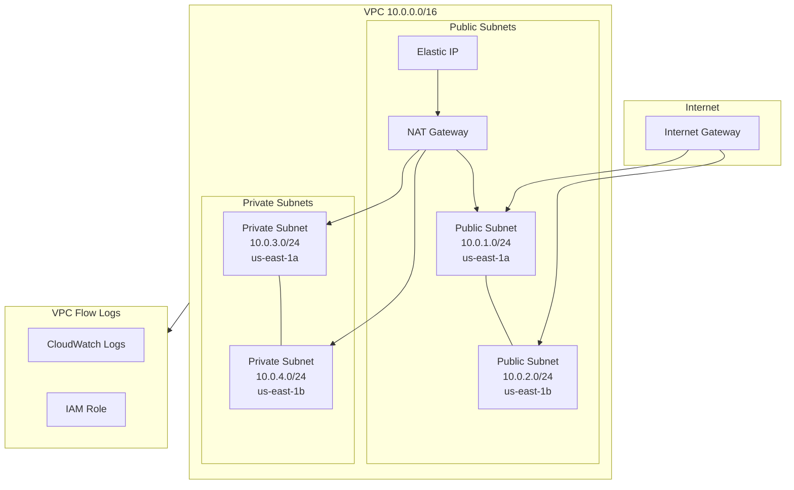

# VPC Module

## Overview

This module creates the core networking infrastructure for the Grafana Stack on AWS. It provisions a VPC with public and private subnets across multiple Availability Zones, along with internet and NAT gateways for connectivity.

## Architecture



## Resources Created

| Resource | Description |
|----------|-------------|
| `aws_vpc.main` | Main VPC with DNS support |
| `aws_internet_gateway.main` | Internet gateway for public subnets |
| `aws_subnet.public` | Public subnets (2x /24) |
| `aws_subnet.private` | Private subnets (2x /24) |
| `aws_eip.nat` | Elastic IP for NAT Gateway |
| `aws_nat_gateway.main` | NAT Gateway for private subnet internet access |
| `aws_route_table.public` | Route table for public subnets |
| `aws_route_table.private` | Route table for private subnets |
| `aws_route_table_association.public` | Route table associations for public subnets |
| `aws_route_table_association.private` | Route table associations for private subnets |
| `aws_flow_log.vpc_flow_log` | VPC Flow Logs to CloudWatch |
| `aws_cloudwatch_log_group.vpc_flow_log` | Log group for VPC Flow Logs |
| `aws_iam_role.vpc_flow_log` | IAM role for VPC Flow Logs |
| `aws_iam_role_policy.vpc_flow_log` | IAM policy for VPC Flow Logs |

## Variables

| Variable | Type | Default | Description |
|----------|------|---------|-------------|
| `project_name` | `string` | - | The name of the project |
| `env_subfix` | `string` | - | Environment suffix |
| `region` | `string` | - | AWS region |
| `vpc_cidr` | `string` | `10.0.0.0/16` | CIDR block for the VPC |
| `public_subnet_cidrs` | `list(string)` | `["10.0.1.0/24", "10.0.2.0/24"]` | CIDR blocks for public subnets |
| `private_subnet_cidrs` | `list(string)` | `["10.0.3.0/24", "10.0.4.0/24"]` | CIDR blocks for private subnets |
| `availability_zones` | `list(string)` | `["us-east-1a", "us-east-1b"]` | Availability zones |
| `tags_project` | `map(string)` | - | Tags to apply to all resources |

## Outputs

| Output | Description |
|--------|-------------|
| `vpc_id` | The ID of the VPC |
| `vpc_cidr` | The CIDR block of the VPC |
| `public_subnet_ids` | List of public subnet IDs |
| `private_subnet_ids` | List of private subnet IDs |
| `public_subnet_cidrs` | List of public subnet CIDR blocks |
| `private_subnet_cidrs` | List of private subnet CIDR blocks |
| `internet_gateway_id` | The ID of the Internet Gateway |
| `nat_gateway_id` | The ID of the NAT Gateway |
| `nat_gateway_public_ip` | The public IP of the NAT Gateway |
| `public_route_table_id` | The ID of the public route table |
| `private_route_table_id` | The ID of the private route table |
| `availability_zones` | List of availability zones used |

## Usage

```hcl
module "vpc" {
  source = "../../modules/vpc"

  project_name = "grafana-stack"
  env_subfix   = "nonprod"
  region       = "us-east-1"
  tags_project = {
    Project     = "grafana-stack"
    Environment = "nonprod"
    ManagedBy   = "terraform"
  }
}
```

## Network Design

- **Public Subnets**: Host the ALB, NAT Gateway, and other internet-facing resources
- **Private Subnets**: Host ECS tasks, EFS, and other internal resources
- **NAT Gateway**: Provides internet access for private subnet resources (outbound only)
- **VPC Flow Logs**: Captures network traffic logs for security and debugging
